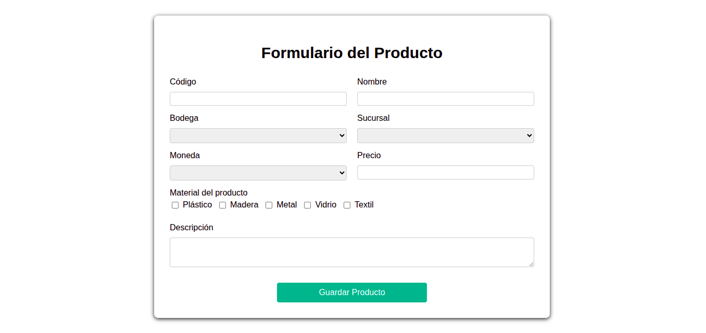

# 🧾 Sistema de Registro de Productos

Aplicación web desarrollada con **PHP**, **JavaScript**, **HTML** y **CSS**, que permite **registrar productos** asociados a bodegas, sucursales, monedas y materiales.

---

## 📦 Estructura del proyecto

```
📁 FormProducto/
│
├── 📁 js/
│   ├── cargarBodegas.js
│   ├── cargarMonedas.js
│   ├── cargarSucursales.js
│   ├── validaciones.js
│   ├── validarCodigo.js
│   ├── enviarFormulario.js
│   └── main.js
│
├── 📁 php/
│   ├── conexion.php
│   ├── cargarBodegas.php
│   ├── cargarSucursales.php
│   ├── cargarMonedas.php
│   ├── cargarCodigo.php
│   └── enviarFormulario.php
│
├── 📁 SQL/
│   ├── estructuraDatos.sql
│   └── cargarDatos.sql
│
├── formulario.css
├── index.html
├── formulario.png (imagen del resultado)
└── README.md
```

---

## ⚙️ Requisitos previos

| Requisito | Descripción |
|------------|-------------|
| **PHP v8.1+** | Backend encargado de procesar formularios y conectarse a PostgreSQL. |
| **PostgreSQL 13+** | Base de datos para almacenar la información. |
| **Servidor local** | (XAMPP, Laragon, WAMP o el servidor integrado de PHP). |
| **Navegador moderno** | Chrome, Edge o Firefox. |

---

## ⚙️ Versiones usadas

**PHP v8.3.6**

**PostgreSQL v16.10**

---

## 🛠️ Pasos a seguir para la instalación local

### 1. Clonar el proyecto

Ejecute el siguiente comando para obtener los archivos del proyecto:
```bash
git clone https://github.com/0carloscastillo0/formProducto.git
```

Puede mover la carpeta del proyecto directamente a tu servidor local:

```
/var/www/html/FormProducto/
```

*(En Windows con XAMPP → `C:\xampp\htdocs\FormProducto\`)*

---

### 2. Crear la base de datos en PostgreSQL

Abre **pgAdmin** o la consola **psql**, y ejecuta los siguientes comandos en orden:

#### 🧱 Paso 1: Crear la estructura de datos

```sql
\i '<ruta al proyecto>/SQL/estructuraDatos.sql'
```

Esto creará la base de datos `productos_db` y las tablas:  
`bodega`, `sucursal`, `moneda` y `producto`.

#### 📦 Paso 2: Cargar los datos iniciales

```sql
\i '<ruta al proyecto>/SQL/cargarDatos.sql'
```

Esto insertará los datos base para bodegas, sucursales, monedas y un producto de ejemplo.

#### 📦 Nota: Si aparece "permiso denegado".

 Es porque el archivo se encuentra dentro de una carpeta protegida (en Windows, sería algo como C:\Program Files o C:\Windows). Para resolverlo, ejecute lo siguiente:

En **Windows**, basta con que el archivo este dentro de la ubicación de Xampp o desde la carpeta del servidor local.
```sql
Ejemplos:
'C:\xampp\'
'C:\User\'
```
Y nuevamente, ejecutar los comandos anteriores para generar la base de datos y cargar los datos.

En **Linux/macOS**, una opción sería mover el archivo a una carpeta accesible por PostgreSQL (como la carpeta /tmp), de la siguiente forma:
```sql
cp '<ruta al proyecto>/SQL/estructuraDatos.sql' /tmp/
```
y despues, dentro de psql:
```sql
\i '/tmp/estructuraDatos.sql'
```
si no arroja error en consola, ejecuta los mismos comandos para el script cargarDatos.sql

---

### 3. Configurar la conexión a PostgreSQL

Edita el archivo `php/conexion.php` con tus credenciales locales (si usas el servidor por defecto de postgresl, solo modifica tu_contraseña):

```php
<?php
// Edita aquí tus credenciales (a excepción de $dbname)
$host = "localhost";
$port = "5432";
$dbname = "productos_db";
$user = "postgres";
$password = "tu_contraseña";

try {
    $pdo = new PDO("pgsql:host=$host;port=$port;dbname=$dbname", $user, $password);
    $pdo->setAttribute(PDO::ATTR_ERRMODE, PDO::ERRMODE_EXCEPTION);
} catch (PDOException $e) {
    echo "Error de conexión: " . $e->getMessage();
    exit();
}
?>
```

---

### 4. Iniciar el servidor local

Desde la terminal, dentro del proyecto (en la ubicación del archivo index.html):

```bash
php -S localhost:8000
```

Luego, abre tu navegador y accede a:

```
http://localhost:8000/index.html
```

Debería mostrar el siguiente formulario listo para probar:



---
## 🛠️ Pasos a seguir para ejecutar el programa con DOCKER
EN PROCESO.....